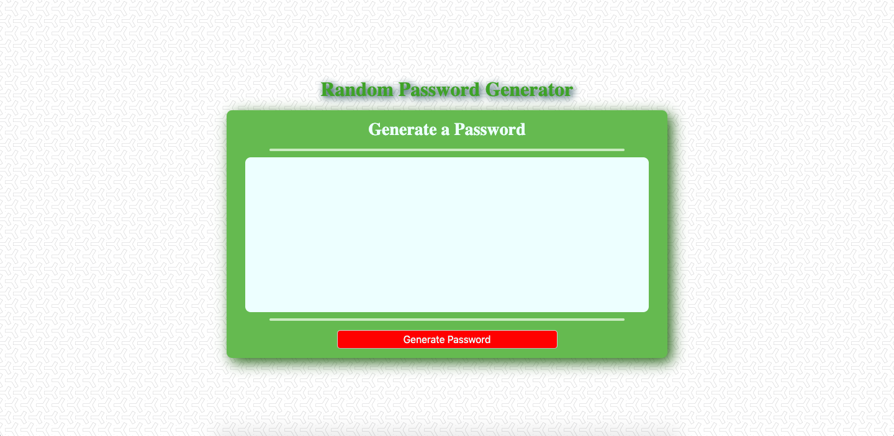

# Random Password Generator

## Features

- Allows user to choose the length of password and what types of characters are to be included.
- Users can choose from lowerAlpha, upperAlpha, special characters, and numbers.
- Password is randomly generated by creating random numbers and using them to index an array of characters the user chose.
- Program can be run multiple times in a row.

## Deployed App

[Here](https://garrettmroberts.github.io/vcb-h3/)

## Known Bugs / Needs Adjustment

- Color scheme is not color-blind friendly.
- Longer passwords surpass the margins of the generator.
- If the user chooses no characters to be included on a second run of the program, it locks up the window.

## Screenshot

